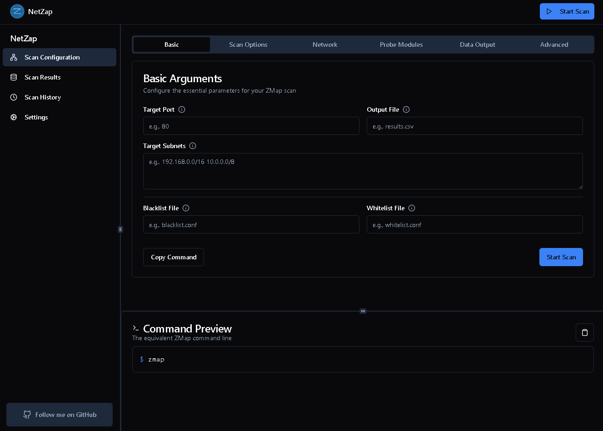

# NetZap

A NextJS project with zmap integration for network scanning.


## Requirements

- Docker installed on your system

## Quick Start with Docker

### Pull from Docker Hub
```bash
docker run -d --name netzap -p 3000:3000 happyhackingspace/netzap:latest
```

### Access the Application
Open your browser and navigate to `http://localhost:3000`

### Screenshot



## Manual Setup and Run

1. Clone the repository:
   ```bash
   git clone https://github.com/HappyHackingSpace/NetZap
   cd netzap
   ```

2. Build and start using Docker Compose:
   ```bash
   docker-compose up -d --build
   ```

## About zmap

This project includes [zmap](https://zmap.io/), a fast network scanner. The Docker configuration automatically:

- Installs zmap and its dependencies
- Grants the necessary network capabilities (NET_RAW, NET_ADMIN)
- Runs the zmap.sh script before starting the NextJS application


## Development

To work on the project in development mode:

```bash
docker-compose up
```

This will start the container with live reload enabled.

## License

MIT License - See the [LICENSE](./LICENSE) file for details.

## DISCLAIMER

NetZap is intended for legitimate network scanning and security purposes only. 
Users are responsible for ensuring they have proper authorization before scanning any networks.
The developers of NetZap are not responsible for any misuse or illegal activities performed with this tool.
Always scan only networks you own or have explicit permission to scan.

## CONTRIBUTIONS

Contributions to NetZap are welcome. To contribute:

1. Fork the repository
2. Create a feature branch (`git checkout -b feature/amazing-feature`)
3. Commit your changes (`git commit -m 'Add some amazing feature'`)
4. Push to the branch (`git push origin feature/amazing-feature`)
5. Open a Pull Request

All contributions must follow the code of conduct and must not infringe on intellectual property rights.
